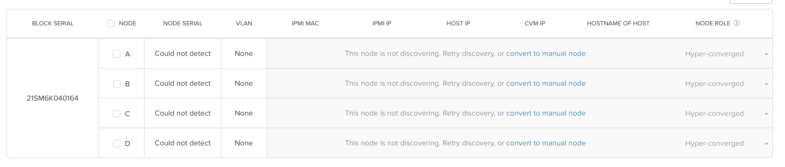
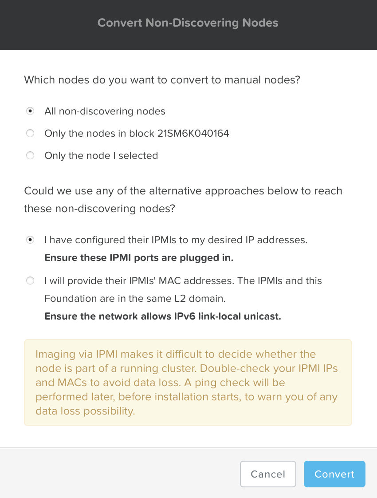
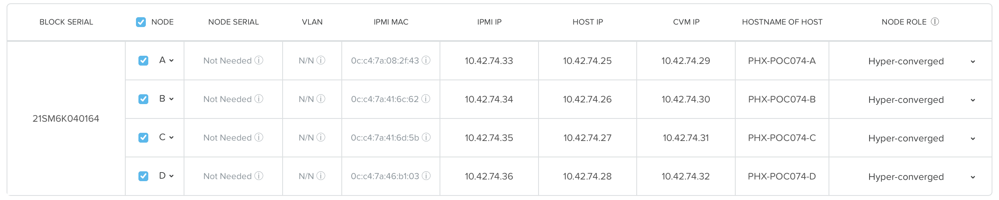
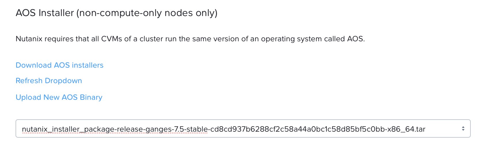
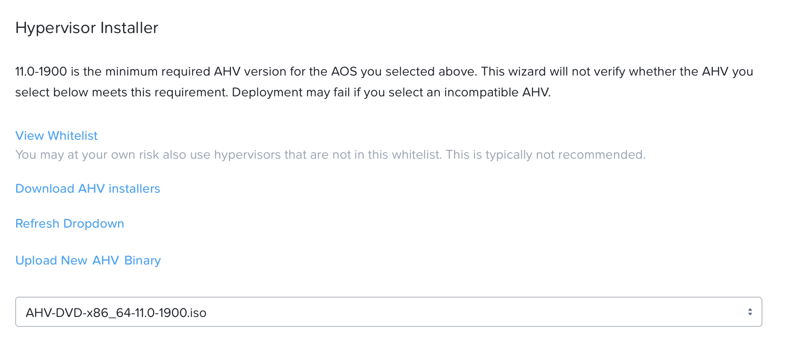
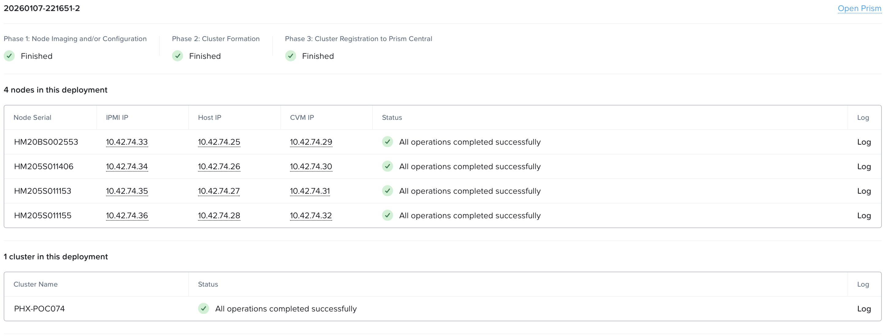

# Overview

Foundation is used to automate the installation of the hypervisor and
Controller VM on one or more nodes. In this exercise you will practice
imaging a physical cluster with Foundation. That Foundation instance will be used to
image and create a cluster from the remaining 4 nodes in the Block.

!!! info
    Estimated time to complete: **60 Minutes**

!!! warning
    In following steps, you should replace xx part of the IP octet with your assigned cluster ID


## Upload AOS and AHV Image

!!!note
       We will do this section of the lab from your desktop (Windows or Mac) computer. This is the fastest way as remote consoles will be slow.

By default, Foundation does not have any AOS or hypervisor images. You can download your desired AOS package from the [Nutanix Portal](https://portal.nutanix.com/#/page/releases/nosDetails).

If downloading the AOS package within the Foundation VM, the ``.tar.gz`` package can also be moved to ``~/foundation/nos`` rather than uploaded to Foundation through the web UI.

To shorten the lab time, we use command line to access foundation VM and download NOS binary to designated folder in it.

1.  Open a terminal in your desktop computer (Putty or Mac Terminal) and ssh to **Foundation VM** through foundation IP ``10.42.xx.45``. The default password for the Foundation VM can be found on step 7 of the [Field Installation Guide](https://portal.nutanix.com/page/documents/details?targetId=Field-Installation-Guide-v5_5:fie-foundation-vm-install-on-workstation-t.html).


    ```{ .text .no-copy }
    $ ssh -l nutanix _Foundation_VM_IP  # - ask instructor if you are unaware 
    # use default password # ask instructor if you are unaware   
    ```

2. Download the **AOS** installer by copying the file name and url from the Downloads page to the command below
    
    !!!note
           At the time of writing this lab, NOS 7.5 is the latest available version. The URL for the latest Foundation VM QCOW2 image can be downloaded from the [Nutanix Portal NOS](https://portal.nutanix.com/page/downloads?product=nos)

    ```{ .text .no-copy }
    $ cd /home/nutanix/foundation/nos
    $ curl -o nutanix_installer_package-release-ganges-7.0.1.11-xxxx-x86_64.tar.gz  "_url_copied_from_download_page"
    ```

3. Download the **AHV** installer by copying the file name and url from the Downloads page to the command below
    
    !!!note
           At the time of writing this lab, AHV 11 is the latest available version. The URL for the latest Foundation VM QCOW2 image can be downloaded from the [Nutanix Portal NOS](https://portal.nutanix.com/page/downloads?product=ahv)
    
    ```{ .text .no-copy }
    $ cd /home/nutanix/foundation/isos/hypervisor/kvm
    $ curl -o AHV-DVD-x86_64-11.0-1900.iso "_url_copied_from_download_page"
    ```


## Find MAC Address of Nodes

11. Access Node A IPMI through IP 10.42.xx.33 with ADMIN/ADMIN

    

    

    !!! info

        There are at least 2 methods to get MAC address remotely.

        Method.1: Identify IPMI MAC Address (BMC MAC address) of Nodes (A, B, and C) by accessing IPMI IP in a browser for each node 
        
        Method.2 Identify IPMI MAC Address of Nodes (A, B, C) by logging to the AHV hosts with User: root, Password: *default* for each node and using the following commands: 
        
        ``` bash
        ssh -l root <IP address of Host/Hypervisor>
        ```

        ``` bash
        ipmitool lan print | grep "MAC Address" 
        ```
        ```bash
        # output here 
        MAC Address             : 0c:c4:7a:3c:c9:ad
        # repeat for nodes B and C for unique IPMI MAC addresses
        ```

12. Record your NODE A/B/C/D BMC MAC address (in above example , it is **ac:1f:6b:1e:95:eb** )

    Doing the same with your other 3 nodes B/C, access Node B and C IPMI through IP 10.42.xx.34/35 with ADMIN/ADMIN, record all 3 BMC MAC addresses.


## Perform Foundation

1.  From you desktop computer, open Google Chrome browser and navigate to Foundation VM's IP

5.  Access Foundation UI via any browser at ``http://_Foundation_VM_IP`

3. Click on **import the configuration file.** and upload the JSON file provided to you.
    
4.  Check the following field values with the JSON file that your instructor provides:

    -   **Select your hardware platform**: Autodetect
    -   **Netmask of Every Host and CVM** - use JSON file values
    -   **Gateway of Every Host and CVM** - use JSON file values
    -   **Gateway of Every IPMI** - use JSON file values
    -   **Netmask of Every IPMI** - use JSON file values
    -   Under **Double-check this installer's networking step**
    -   **Skip this Validation** - selected

    

5.  On the **Nodes** page, click on **Discover** and this will fail
    
    ??? tip "Why is discovery failing?"

        Foundation will automatically discover any hosts in the same IPv6 Link Local broadcast domain that is not already part of a cluster. 
        
        We are choosing manual here as the Foundation VM is not in the same L2 switch as the nodes and the discovery cannot happen using IPv6.

        You should be able to do this if the Foundation VM is connected to the same L2 switch.

        When transferring POC assets in the field, it's not uncommon to receive a cluster that wasn't properly destroyed at the conclusion of the previous POC. In that case, the nodes are already part of existing clusters and will not be discovered. 
        
        In this lab, we choose manually specify the MAC address instead in order to practice as the real world.

6.  Choose one node and click **Convert to manual**

    


9. Choose the following options:

    - **Which nodes do you want to convert to manual nodes?** - All non-discovering nodes
    - **I have configured their IPMIs to my desired IP addresses** (as this is out of factory setting for MAC address)
  
    

10. Click on **Convert**

## Configure Node Parameeters

1. Return the Foundation UI - Update the Node column to show "A, B, C, D" (if they don't appear that way)

2.  Replacing the octet(s) that correspond to your HPOC network, check the **top row** fields with the following details:

    -   **IPMI MAC** - the four you just recorded down
    -   **IPMI IP** - use JSON file values
    -   **Hypervisor IP** - use JSON file values
    -   **CVM IP** - use JSON file values
    -   **HOSTNAME OF HOST** - use JSON file values

     

3.  Click **Next**
4.  On the **AOS/Hypervisor** page

     -   **Select an AOS installer** - Select your uploaded (through command line in previous steps) ``nutanix_installer_package-release-*.tar.gz`` file
     -   **Arguments to the AOS Installer (Optional)** - leave blank
 
     
 
     - **Arguments to the AOS Installer (Optional)** - leave blank
     - **CVM Memory Allocation (Optional)** - leave blank
     - **Hypervisor Type** - choose AHV
     - **Hypervisor Installer** - Select your uploaded (through command line in previous steps) ``AHV-DVD-x86_64x.x.x.iso`` file
     
     

     - **LUKS (Linux Unified Key Store)** - choose I don't want to enable LUKS
  
5.  Click **Next**

## Configure 4-node Cluster


6.  In the **Cluster** page, fill the following details:

    -   **Cluster Name** - POCxxx (Eg POC206)
    -   **Prism Central Registration** - I don't want to register this cluster to a Prism Central
    -   **Timezone of Every Hypervisor and CVM** - UTC (leave default)
    -   **Cluster Redundancy Factor** - rf2_default
    -   **Cluster Virtual IP** - use JSON file values
    -   **NTP Servers of Every Hypervisor and CVM**:

            0.pool.ntp.org

    -   **DNS Servers of Every Hypervisor and CVM** - use JSON file values

7.  Click **Next**

8. In the **Security** page
    
    - Set cluster password - ask your instructor
    - Cluster lockdown - leave at default (Cluster Lockdown Disabled)
   
9.  Click **Next**

10. Enter the existing IPMI credentials as **ADMIN** and **ADMIN** for all three nodes. Note that this will be different in the field.

11. Click **Start**

12. Confirm that the installer will be active by clicking on **Won't Sleep**

    

13. In the **Warning of Data Loss Possibility** window, click on **Ignore and Re-image**

    

    Foundation will run a couple of tests to make sure all the configuration details you have provided are correct and then direct you the installation progress page.

14. Click the **Log** link to view the realtime log output from your nodes

    When all CVMs are ready, Foundation initiates the cluster creation process.

15. Monitor the foundation process until completion

    

16. Once Foundation finishes successully, either click on **Open Prism**
    link as shown above or open ``https://<Cluster Virtual IP>:9440`` (10.42.xx.37)in your browser

17. Log in with the following credentials:

    -   **Username** - admin
    -   **Password** - Prism Central default password (If you are not familair with this password, it can be found within the [Prism Element Web Console Guide](https://portal.nutanix.com/page/documents/details?targetId=Web-Console-Guide-Prism-v6_7:wc-login-wc-t.html), step 5.)

18. When prompted, **Change the Password**  to use the same password given by your instructor.

19. Once the password is changed, you can login to Prism Element.

    

20. Enter admin details and enable Pulse 
21. Click Continue
22. Analyse the Dashboard

## Takeaways

You have successfully prepared your environment in a single operation called Foundation:

  - Installed Hypervisor (AHV) - This can also be ESXi or Hyper-V
  - Installed CVM (AOS)
  - Distributed File System (Data Plane)
  - Prism Element (Control Plane) 

Now we will proceed to install Prism Central(PC).  PC can manage several Prism Elements akin to cloud managers provided by public cloud providers. 