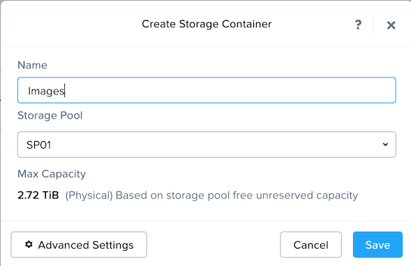
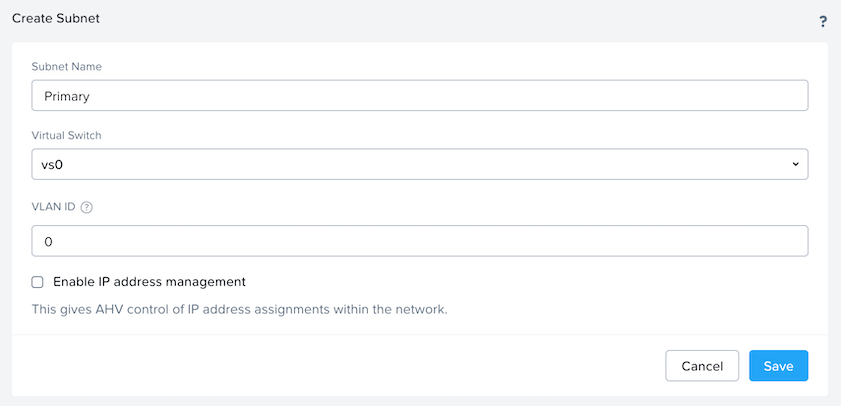
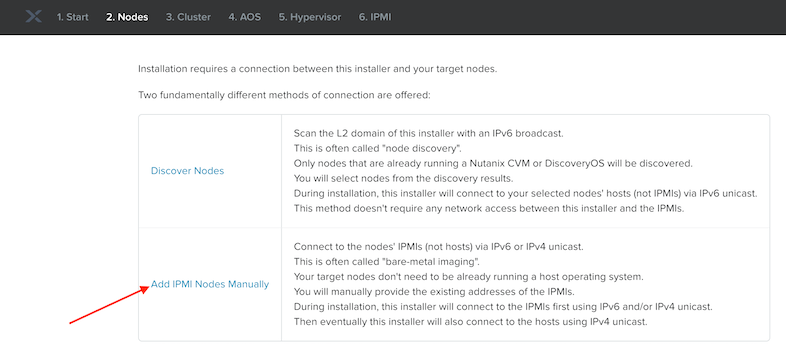
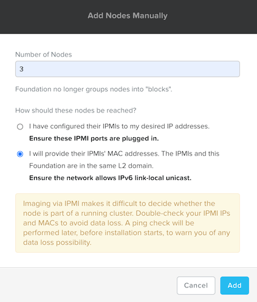
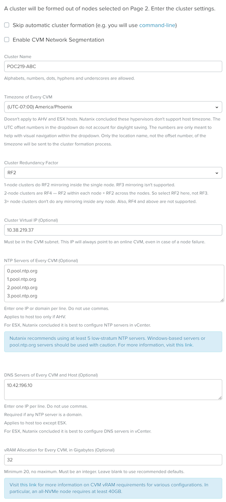
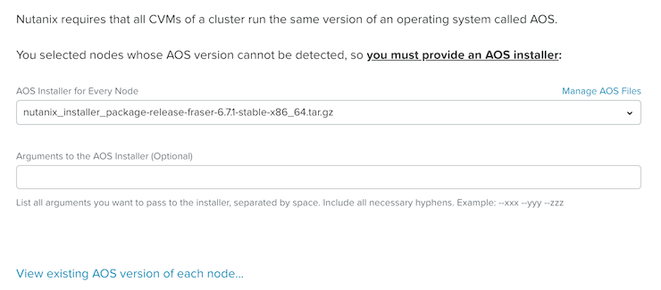

# Overview

!!!info
        Estimated time to complete: **60 Minutes**

Foundation is used to automate the installation of the hypervisor and
Controller VM on one or more nodes. In this exercise you will practice
imaging a physical cluster with Foundation. In order to keep the lab
self-contained, you will create a single node cluster on which you
will deploy your Foundation VM. That Foundation instance will be used to
image and create a cluster from the remaining 3 nodes in the Block.

!!!caution
          In following steps, you should replace xx part of the IP octet with your assigned cluster ID

## DIY Environment

A Hosted POC reservation provides a fully imaged cluster consisting of 4
nodes. To keep the lab self-contained within a single, physical block,
you will:

-   Destroy the existing cluster
-   Confirm the number of SSDs
-   Create a single node cluster using Node D
-   Install the Foundation VM on Node D
-   Use Foundation VM to image Nodes A, B, and C and create a 3 node
    cluster

## Destroy the existing cluster

1.  Using an SSH client, connect to the **Node D CVM IP** ``10.42.xx.32`` in your assigned block using the following credentials:

    -   **Username** - nutanix
    -   **Password** - *check password in RX*

    ```bash title="Login to the console of  NodeD CVM"
    ssh -l nutanix 10.42.xx.32         # password: <check password in RX>
    ```


!!! note

     Occassionally, Node D is not deployed with .32 as the last octet. Make sure you check and confirm the correct IP address for Node D in your RX reservation.

Execute the following commands to power off any running VMs on the cluster, stop cluster services, and destroy the existing cluster:

```bash
cluster stop        # Enter 'I agree' when prompted to proceed
```
```bash
cluster destroy     # Enter 'Y' when prompted to proceed
```

Once you have made sure that all VMs and services are stopped, you can proceed to the next steps. 
## Confirm the Number of SSDs

In this section we will confirm the number of SSDs in your node D. This will determine which command we will use in the next section.

It is likely that all nodes in HPOC cluster will have similar SSD and HDD combination.

1. Login to the CVM to find out the SSD configuration details

    ```bash title="Login to the console of  NodeD CVM"
    ssh -l nutanix 10.42.xx.32         # password: <check password in RX>
    ```
    ``` bash
    lsscsi 
    ```
    ``` { .text .no-copy }
    # Example output here
    [0:0:0:0]    disk    ATA      INTEL SSDSC2BX80 0140  /dev/sda  # << SSD 1
    [0:0:1:0]    disk    ATA      INTEL SSDSC2BX80 0140  /dev/sdb  # << SSD 2
    [0:0:2:0]    disk    ATA      ST91000640NS     SN03  /dev/sdc 
    [0:0:3:0]    disk    ATA      ST91000640NS     SN03  /dev/sdd 
    [0:0:4:0]    disk    ATA      ST91000640NS     SN03  /dev/sde 
    [0:0:5:0]    disk    ATA      ST91000640NS     SN03  /dev/sdf 
    [2:0:0:0]    cd/dvd  QEMU     QEMU DVD-ROM     2.5+  /dev/sr0

    # this output shows that your node D has 2 SSDs 
    ```

    ``` bash
    lsscsi
    ```
    ``` bash
    # Example output here
    [0:0:0:0]    disk    ATA      INTEL SSDSC2BX80 0140  /dev/sda  # << SSD 1
    [0:0:2:0]    disk    ATA      ST91000640NS     SN03  /dev/sdc 
    [0:0:3:0]    disk    ATA      ST91000640NS     SN03  /dev/sdd 
    [0:0:4:0]    disk    ATA      ST91000640NS     SN03  /dev/sde 
    [0:0:5:0]    disk    ATA      ST91000640NS     SN03  /dev/sdf 
    [2:0:0:0]    cd/dvd  QEMU     QEMU DVD-ROM     2.5+  /dev/sr0

    # this output shows that your node D has 1 SSD
    ```

After confirming the number of SSDs choose the appropriate cluster
formation script in the next section.

## Create Node D Cluster

1.  Remaining in SSH client, access Node-D CVM and execute following commands

    ```bash title="Login to the console of Node D CVM"
    ssh -l nutanix 10.42.xx.32 # password: <check password in RX>
    ```

2.  Confirm if your hardware nodes have 1 or more SSD. 2 SSDs are required to privide RF2 redundancy factor in a Nutanix cluster.

    For the purpose of our lab, since we are creating 1 node cluster, we are good to have RF1 as a redundancy factor.

    === "1 SSD Node"

        ```bash
        cluster -s 10.42.xx.32 --redundancy_factor=1 create # Enter 'Y' when prompted to proceed
        ```

    === "2 SSDs Node"

        ```bash
        cluster -s 10.42.xx.32 create # Enter 'Y' when prompted to proceed
        ```

    === "All SSDs Node"

        ```bash
        cluster -s 10.42.xx.32 create # Enter 'Y' when prompted to proceed
        ```

4.  After the single node cluster is formed, run the following commands
    to configure it

    !!!note
           The above command will create a ``cluster`` from a single node using RF1, offering no redundancy to recover from hardware failure.

           This configuration is being used for non-production, instructional purposes and should **NEVER** be used for a customer deployment (unless the hosted application stores two copies of the same data
           e.g. Splunk). This should be agreed with the customer.

           After the ``cluster`` is created, Prism will reflect Critical Health status due to lack of redundancy.


    ``` bash
    ncli cluster edit-params new-name=POCxx-D
    ```
    ``` bash
    ncli cluster add-to-name-servers servers=10.42.196.10
    ```
    ``` bash
    ncli user reset-password user-name='admin' password=<check password in RX> 
    ```

## Install Foundation VM

1.  Open ``https://<Node D CVM IP:9440`` (https://10.42.xx.32:9440) in your browser and log in with the following credentials:

    -   **Username** - admin
    -   **Password** - check password in RX

1.  Accept the EULA and Pulse prompts.

1.  In **Home > Storage > Table > Storage Pool**, right click on the default storage pool and click Update, then rename it to *SP01*

1.  Under **Storage Container**, check if there is a container named *Images*, if not, Click **+ Storage Container** to create a new container named *Images*

    

1.  Go to configuration :fontawesome-solid-gear: (Settings) page and navigate to **Image Configuration**, click **+Upload Image**

1.  Fill out the following fields and click **Save**:

    -   **Name** - Foundation
    -   **Image Type** - Disk
    -   **Storage Container** Images
    -   Select **From URL**
    -   **Image Source** - ``http://10.42.194.11/images/Foundation/Foundation_VM-5.4.2-disk-0.qcow2``

    !!!note
           At the time of writing, Foundation 5.4 is the latest available version. The URL for the latest Foundation VM QCOW2 image can be downloaded from the [Nutanix Portal](https://portal.nutanix.com/#/page/foundation).

           **Unless otherwise directed by support, always use the latest version of Foundation in a field installation.**
           
           For the puposes of this lab, the Foundation VM image is stored in a HPOC file server

1.  Before creating the VM, we must first create a virtual network to
    assign to the Foundation VM. The network will use the Native VLAN
    assigned to the physical uplinks for all 4 nodes in the block.

1.  In the Prism Element UI click :fontawesome-solid-gear: > **Network Configuration > Create Subnet**

1. Fill out the following fields:

    -   **Name** - Primary
    -   **VLAN ID** - 0
    -   Enable IP address management - leave it unselected

    

1. Click on **Save**

1. In **Settings > VM > Table** and click **+ Create VM**.

1. Fill out the following fields

    -   **Name** - Foundation
    -   **vCPU(s)** - 2
    -   **Number of Cores per vCPU** - 1
    -   **Memory** - 8 Gi

    

1. Select **+ Add New Disk**

    -   **Operation** - Clone from Image Service
    -   **Image** - Foundation
    -   Select **Add**

    

1. Select **Add New NIC**

    -   **Subnet Name** - Primary
    -   Select **Add**

    

    Once NIC is added, you should see the NIC configuration in the VM
    create window as shown here

    

1. Click on **Save**

## Config Foundation VM

1.  Select your **Foundation** VM and click **Power on**.

2.  Once the VM has started, click **Launch Console**.

3.  Once the VM has finished booting, return to Prism element and note
    down the IP address of the Foundation VM.

4.  Prism Element > **VM** > **Table** > **Foundation VM** > **VM NICs**

    

    !!!caution
              The IP address is received from the Primary network default DHCP pool. Your Foundation VM's IP address will be different.
    
## Foundation Node ABC cluster

!!!note
       We will do this section of the lab from your desktop (Windows or Mac) computer. This is the fastest way as remote consoles will be slow.

By default, Foundation does not have any AOS or hypervisor images. You can download your desired AOS package from the [Nutanix Portal](https://portal.nutanix.com/#/page/releases/nosDetails).

If downloading the AOS package within the Foundation VM, the ``.tar.gz`` package can also be moved to ``~/foundation/nos`` rather than uploaded to Foundation through the web UI.

To shorten the lab time, we use command line to access foundation VM and download NOS binary to designated folder in it.

1.  Open a terminal in your desktop computer (Putty or Mac Terminal) and ssh to **Foundation VM** through foundation IP ``10.42.xx.45``. The default password for the Foundation VM can be found on step 7 of the [Field Installation Guide](https://portal.nutanix.com/page/documents/details?targetId=Field-Installation-Guide-v5_5:fie-foundation-vm-install-on-workstation-t.html).

    ```bash title="Login to the console of Foundation VM"
    ssh -l nutanix <Foundation VM IP>  # use default password - ask instructor if you are unaware
    # example
    # ssh -l nutanix 10.42.xx.51     
    ```
    ```bash
    cd foundation
    cd nos
    curl -O http://10.42.194.11/images/AOS/6.7.1/nutanix_installer_package-release-fraser-6.7.1-stable-x86_64.tar.gz
    ```

    !!!Alert
           When you see 100% finished status, AOS 6.7.1 package has been downloaded to ``~/foundation/nos`` folder.

1.  From you desktop computer, open Google Chrome browser and navigate to Foundation VM's IP

1.  Access Foundation UI via any browser at ``http://<Foundation VM IP>``

1.  Fill the following fields:

    -   **Select your hardware platform**: Autodetect
    -   **Netmask of Every Host and CVM** - 255.255.255.128
    -   **Gateway of Every Host and CVM** - 10.42.xx.1
    -   **Gateway of Every IPMI** - 10.42.xx.1
    -   **Netmask of Every IPMI** - 255.255.255.128
    -   Under **Double-check this installer's networking step**
    -   **Skip this Validation** - selected

    

1.  On the **Nodes** page, click **Add IPMI Nodes Manually**

    

1.  Fill in block information, fill in the following information:

    -   **Number of nodes** - 3
    -   **How should these nodes be reached?** - choose **I will provide the IPMIs' MAC addresses**

1.  Click **Add**

    

    !!!tip 
           Foundation will automatically discover any hosts in the same IPv6 Link Local broadcast domain that is not already part of a cluster. 
           
           When transferring POC assets in the field, it's not uncommon to receive a cluster that wasn't properly destroyed at the conclusion of the previous POC. In that case, the nodes are already part of existing clusters and will not be discovered. 
           
           In this lab, we choose manually specify the MAC address instead in order to practice as the real world.

    !!!info
           There are at least 2 methods to get MAC address remotely.

           Method.1: Identify IPMI MAC Address (BMC MAC address) of Nodes (A, B, and C) by accessing IPMI IP in a browser for each node 
           
           Method.2 Identify IPMI MAC Address of Nodes (A, B, C) by logging to the AHV hosts with User: root, Password: *default* for each node and using the following commands: 
           
           ``` bash
           ssh -l root <IP address of Host/Hypervisor>
           ```

           ``` bash
           ipmitool lan print | grep "MAC Address" 
           ```
           ```bash
           # output here 
           MAC Address             : 0c:c4:7a:3c:c9:ad
           # repeat for nodes B and C for unique IPMI MAC addresses
           ```

1.  Access Node A IPMI through IP 10.42.xx.33 with ADMIN/ADMIN

    

    

1. Record your NODE A/B/C BMC MAC address (in above example , it is **ac:1f:6b:1e:95:eb** )

    Doing the same with your other 2 nodes B/C, access Node B and C IPMI through IP 10.42.xx.34/35 with ADMIN/ADMIN, record all 3 BMC MAC addresses.

1. Update the Node column to show "A, B, C", rather than A, A, A.

1. Click **Tools** and select **Range Autofill** from the drop down list

1. Replacing the octet(s) that correspond to your HPOC network, fill out the **top row** fields with the following details:

    -   **IPMI MAC** - the three your just recorded down
    -   **IPMI IP** - 10.42.xx.
    -   **Hypervisor IP** - 10.42.xx.25
    -   **CVM IP** - 10.42.xx.29
    -   **HOSTNAME OF HOST** -- POCxx-A

    

1. Click **Next**

1. In the **Cluster** page, fill the following details:

    -   **Cluster Name** - POCxx-ABC
    -   **Timezone of Every Hypervisor and CVM** - America/Phoenix
    -   **Cluster Redundancy Factor** - RF2
    -   **Cluster Virtual IP** - 10.42.xx.37
    -   **NTP Servers of Every Hypervisor and CVM**:

            0.pool.ntp.org
            1.pool.ntp.org
            2.pool.ntp.org
            3.pool.ntp.org

    -   **DNS Servers of Every Hypervisor and CVM** - 10.42.196.10
    -   **vRAM Allocation for Every CVM, in Gigabytes** - 32

    

1. Click **Next**

    -   **Select an AOS installer** - Select your uploaded (through
        command line in previous steps)
        *nutanix_installer_package-release-*.tar.gz* file
    -   **Arguments to the AOS Installer (Optional)** - leave blank

    

1. Click **Next**

1. Fill out the following fields and click **Next**:

    -   **Select a hypervisor installer** - AHV, AHV installer bundled inside the AOS installer

    

    !!!tip
          Every AOS release contains a version of AHV bundle with that release.
    
1. Click **Next**

1. Enter the existing IPMI credentials as **ADMIN** and **ADMIN** for all three nodes. Note that this will be different in the field.

    

1. Click **Start**

1. Confirm that the installer will be active by clicking on **Won't Sleep**

    

1. In the **Warning of Data Loss Possibility** window, click on **Ignore and Re-image**

    

    Foundation will run a couple of tests to make sure all the configuration details you have provided are correct and then direct you the installation progress page.

1. Click the **Log** link to view the realtime log output from your node.

    

    When all CVMs are ready, Foundation initiates the cluster creation process.

1. Monitor the foundation process until completion

    

1. Once Foundation finishes successully, either click on **Click here**
    link as shown above or open ``https://<Cluster Virtual IP>:9440`` (10.42.xx.37)in your browser

1. Log in with the following credentials:

    -   **Username** - admin
    -   **Password** - Prism Central default password (If you are not familair with this password, it can be found within the [Prism Element Web Console Guide](https://portal.nutanix.com/page/documents/details?targetId=Web-Console-Guide-Prism-v6_7:wc-login-wc-t.html), step 5.)

1. When prompted, **Change the Password**  to use the same password from RX.

1. Once the password is changed, you can login to Prism Element.

    

## Takeaways

You have successfully prepared your environment in a single operation called Foundation:

  - Installed Hypervisor (AHV) - This can also be ESXi or Hyper-V
  - Installed CVM (AOS)
    - Distributed File System (Data Plane)
    - Prism Element (Control Plane) 

Now we will proceed to install Prism Central(PC).  PC can manage several Prism Elements akin to cloud managers provided by public cloud providers. 