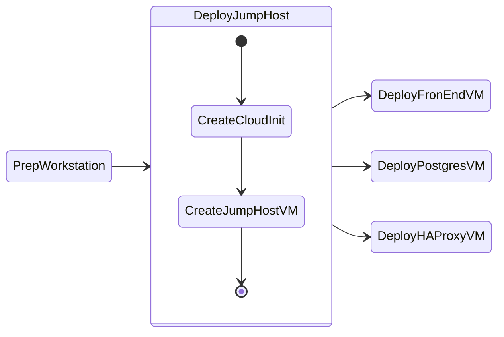
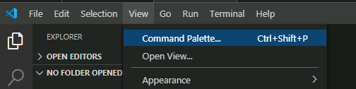
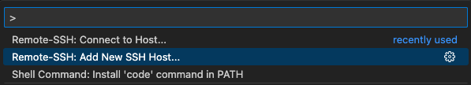
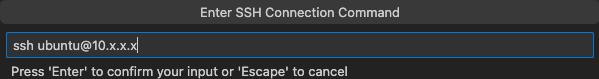
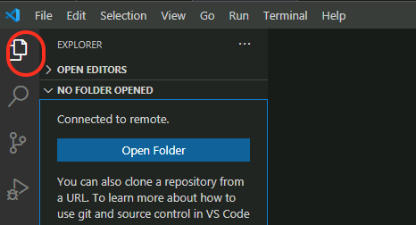
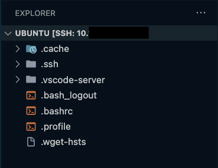

# Deploy Jumphost

We will go through three phases in this section to deploy jumphost VM which you will use to deploy AI applications.

1. **Create Cloud-Init:** needed to bootstrap JumpHost VM on Nutanix AHV using OpenTofu
2. **Create Jumphost VM:** needed to remotely connect and run deployment workflows accessible to Nutanix Infrastructure.



## Jump Host VM Requirements

Based on the [Nutanix GPT-in-a-Box](https://opendocs.nutanix.com/gpt-in-a-box/kubernetes/v0.2/getting_started/#spec) specifications, the following system resources are required for the `Jump Host` VM:

- Target OS: `Ubuntu 24.04 LTS`

Minimum System Requirements:

| CPU    | Cores Per CPU | Memory | Storage |
| ------ | ------------- | ------ | ------- |
| 2 vCPU | 4 Cores       | 16 GiB | 300 GiB |

## Create Jump Host VM

### Deploy Application VM via Prism UI

1. Log into Prism Central, navigate to Compute > VMs > Table view > + Create VM.​

    - General: Name app-vm-01, 
    - 2 vCPU, 4GB RAM
    - Boot Config: UEFI, attach Ubuntu/CentOS cloud image as SCSI disk 0.

2. NICs: Add NIC on your lab subnet (DHCP enabled).
    
3. Create the cloud-init file in ``VScode`` 
   
4. Fill in, paste userdata for hostname app-vm-01, user ubuntu/centos, SSH authorized_keys.
   
    ```yaml hl_lines="2 27"
    #cloud-config
    hostname: jumphost-user01                  # (1)
    package_update: true
    package_upgrade: true
    package_reboot_if_required: true
    packages:
      - open-iscsi
      - nfs-common
      - bind-utils
      - nmap
      - curl
      - wget
      - git
      - nodejs
      - npm
      - postgresql-client
      - python3
      - python3-pip
      - unzip
    users:
      - default
      - name: ubuntu
        groups: sudo
        shell: /bin/bash
        sudo:
          - 'ALL=(ALL) NOPASSWD:ALL'
        ssh-authorized-keys: 
        - ssh-rsa AAAAB3Nxxxxxxxx ...                   # (2)
    runcmd:
      - systemctl stop ufw && systemctl disable ufw
      - eject
      - reboot
    ```

    1. :material-fountain-pen-tip: Change to your user name (user01, user02, etc.)
  
    2. :material-fountain-pen-tip: Copy and paste the contents of your ``~/.ssh/id_rsa.pub`` file

          ---

          If you are using a Mac, the command ``pbcopy``can be used to copy the contents of a file to clipboard.

          ```bash
          cat ~/.ssh/id_rsa.pub | tr -d '\n' | pbcopy
          ```

          ++cmd+"v"++ will paste the contents of clipboard to the console.

5. Copy the contents of the cloud-init.yaml file from VSCode to Prisum UI's client configuration section
   
6. Save and power on VM.

7. Verify VM powers on successfully in VM table and console

### Initiate Remote-SSH Connection to Jumpbox using VSCode

1. In VSCode, click on Settings menu icon (gear icon) :gear: > **Settings** > **Extensions**
2. In the search window search for **Remote SSH**
3. Install the [Remote-SSH Extension](https://marketplace.visualstudio.com/items?itemName=ms-vscode-remote.remote-ssh) from VSCode Marketplace
4. click on the **Install** button for the extenstion.

5. From your workstation, open **Visual Studio Code**.

6. Click **View > Command Palette**.

    

7. Click on **+ Add New SSH Host**

    

8. Type ``ssh jumphost_VM-IP-ADDRESS``and hit **Enter**.

    

9. Select the location to update the config file.

    === "Mac/Linux"

        ```bash
        /Users/<your-username>/.ssh/config
        ```

    === "Windows"

        ```PowerShell
        C:\\Users\\<your-username>\\.ssh\\config
        ```

10. Open the ssh config file on your workstation to verify the contents. It should be similar to the following content

    ```yaml
    Host jumphost
        HostName 10.x.x.x # (1)!
        IdentityFile ~/.ssh/id_rsa # (2)!
        User ubuntu
    ```

    1. :material-fountain-pen-tip: This is Jumphost VM IP address

    2. :material-fountain-pen-tip: This would be the path to RSA private key generated in the previous [JumpHost](../infra/workstation.md#generate-a-rsa-key-pair) section

    Now that we have saved the ssh credentials, we are able to connect to the jumphost VM


### Connect to you Jumpbox using VSCode

1. On `VSCode`, Click **View > Command Palette** and **Connect to Host**

2. Select the IP address of your `Jump Host` VM

3. A **New Window** :material-dock-window: will open in `VSCode`

4. Click the **Explorer** button from the left-hand toolbar and select **Open Folder**.

    

5. Provide the ``$HOME/`` as the folder you want to open and click on **OK**.

    !!!note
           Ensure that **bin** is NOT highlighted otherwise the editor will attempt to autofill ``/bin/``. You can avoid this by clicking in the path field *before* clicking **OK**.

    !!!warning
           The connection may take up to 1 minute to display the root folder structure of the jumphost VM.

6. Accept any warning message about trusting the author of the folder

    

### Install OpenTofu

[OpenTofu](https://opentofu.org/) is a fork of Terraform that is open-source, community-driven, and managed by the Linux Foundation and is used to simplify provisioning resources using the [Nutanix Terraform Provider](https://registry.terraform.io/providers/nutanix/nutanix/latest/docs) while following Infrastructure as Code (IaC) practices.

To [Install OpenTofu](https://opentofu.org/docs/intro/install/standalone/), follow the steps below for your respective local workstation:


```bash title="Download the installer script:"
curl --proto '=https' --tlsv1.2 -fsSL https://get.opentofu.org/install-opentofu.sh -o install-opentofu.sh
```
```bash title="Give it execution permissions:"
chmod +x install-opentofu.sh
```
```bash title="Run the installer:"
./install-opentofu.sh --install-method standalone
```