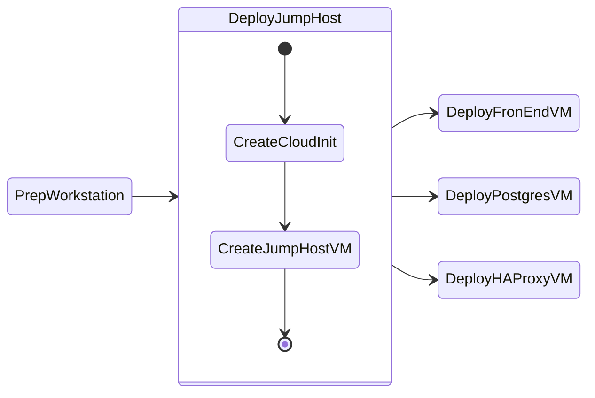

# Deploy Jumphost

We will go through three phases in this section to deploy jumphost VM which you will use to deploy AI applications.

1. **Create Cloud-Init:** needed to bootstrap JumpHost VM on Nutanix AHV using OpenTofu
2. **Create Jumphost VM:** needed to remotely connect and run deployment workflows accessible to Nutanix Infrastructure.



## Jump Host VM Requirements

Based on the [Nutanix GPT-in-a-Box](https://opendocs.nutanix.com/gpt-in-a-box/kubernetes/v0.2/getting_started/#spec) specifications, the following system resources are required for the `Jump Host` VM:

- Target OS: `Ubuntu 24.04 LTS`

Minimum System Requirements:

| CPU    | Cores Per CPU | Memory | Storage |
| ------ | ------------- | ------ | ------- |
| 2 vCPU | 4 Cores       | 16 GiB | 300 GiB |

## Deploy Jumphost VM via Prism UI

1. Log into Prism Central, navigate to Compute > VMs > Table view > + Create VM.​

    - General: Name app-vm-01, 
    - 2 vCPU, 4GB RAM
    - Boot Config: UEFI, attach Ubuntu/CentOS cloud image as SCSI disk 0.

2. NICs: Add NIC on your lab subnet (DHCP enabled).
    
3. Create the cloud-init file in ``VScode`` 
   
4. Fill in, paste userdata for hostname app-vm-01, user ubuntu/centos, SSH authorized_keys.
   
    ```yaml hl_lines="2 27"
    #cloud-config
    hostname: jumphost-user01                  # (1)
    package_update: true
    package_upgrade: true
    package_reboot_if_required: true
    packages:
      - open-iscsi
      - nfs-common
      - bind-utils
      - nmap
      - curl
      - wget
      - git
      - nodejs
      - npm
      - postgresql-client
      - python3
      - python3-pip
      - unzip
    users:
      - default
      - name: ubuntu
        groups: sudo
        shell: /bin/bash
        sudo:
          - 'ALL=(ALL) NOPASSWD:ALL'
        ssh-authorized-keys: 
        - ssh-rsa AAAAB3Nxxxxxxxx ...                   # (2)
    runcmd:
      - systemctl stop ufw && systemctl disable ufw
      - usermod -aG docker ubuntu
      - 'su - ubuntu -c "curl -fsSL https://raw.githubusercontent.com/ariesbabu/ocp-gitp/refs/heads/main/docs/toolsvms/install_vscode_tools.sh | bash"'
      - eject
      - reboot
    ```

    1. :material-fountain-pen-tip: Change to your user name (user01, user02, etc.)
  
    2. :material-fountain-pen-tip: Copy and paste the contents of your ``~/.ssh/id_rsa.pub`` file

          ---

          If you are using a Mac, the command ``pbcopy``can be used to copy the contents of a file to clipboard.

          ```bash
          cat ~/.ssh/id_rsa.pub | tr -d '\n' | pbcopy
          ```

          ++cmd+"v"++ will paste the contents of clipboard to the console.

5. Copy the contents of the cloud-init.yaml file from VSCode to Prisum UI's client configuration section
   
6. Save and power on VM.

7. Verify VM powers on successfully in VM table and console


!!! warning 

    It may take up to 10 minutes for the VM to be ready. The VM will reboot once to finish the installation process.
    
    You can watch the console of the VM from Prism Central to make sure all the cloudinit script has finished running.
    
    Cloudinit logs are stored in /var/log/cloud-init.log

    Logon to the tools VM using SSH
   
    ```bash
    ssh -l ubuntu _your_jumphost_ip # Get the IP address of the jumphost VM from Prism UI
    ```
       
    If there are issues, monitor the cloudinit process logs
         
    ```bash
    tail -f /var/log/cloud-init.log
    ```
             
    Get the IP address of the jumphost VM from Prism UI
              

### Connect to you Jumpbox using VSCode

1. In you browser visit the following URL
   
    === "Template URL"
 
        ```url
        https://_your_jumphost_ip
        ```
 
    === "Sample URL"
 
        ```url
        https://10.54.63.96
        ```

2. Enter ``_password`` as the password

3. Open the following file in VSCode Explorer window

    ```bash
    /home/ubuntu/.config/code-server/config.yaml
    ```

4. Change the password to your desired password
   
    ```bash {3}
    bind-addr: 0.0.0.0:443  # Only bind to localhost
    auth: password
    password: _desired_password # Replace with a strong password
    cert: true
    ```

5. Restart VSCode server daemon

    ```bash
    sudo systemctl restart code-server@$USER
    ```

!!! warning

    It will take a minute or so for VSCode to start 
   

6. Connect to VSCode on the browser and login using the new password 

### Install OpenTofu

[OpenTofu](https://opentofu.org/) is a fork of Terraform that is open-source, community-driven, and managed by the Linux Foundation and is used to simplify provisioning resources using the [Nutanix Terraform Provider](https://registry.terraform.io/providers/nutanix/nutanix/latest/docs) while following Infrastructure as Code (IaC) practices.

To [Install OpenTofu](https://opentofu.org/docs/intro/install/standalone/), follow the steps below for your respective local workstation:

1. In VSCode > Go to Terminal > New Terminal
2. Execute the following commands

    ```bash title="Download the Tofu installer script:"
    curl --proto '=https' --tlsv1.2 -fsSL https://get.opentofu.org/install-opentofu.sh -o install-opentofu.sh
    ```
    ```bash title="Give it execution permissions:"
    chmod +x install-opentofu.sh
    ```
    ```bash title="Run the installer:"
    ./install-opentofu.sh --install-method
    ```