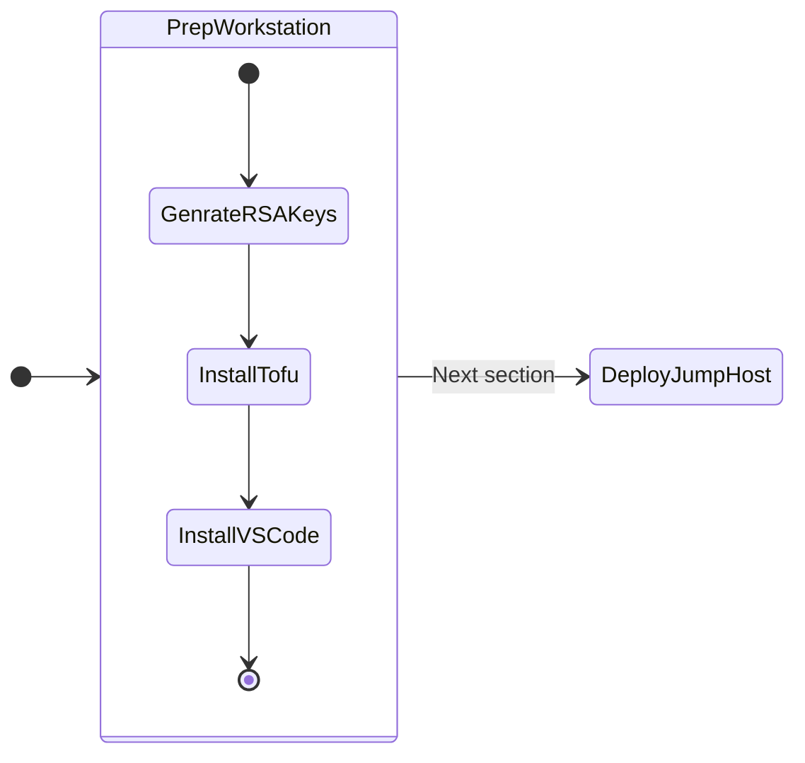

# Workstation Setup

We will be going through creating resources and installing tools on your PC/Mac. 



!!!note
       These are the only binaries that you will need to install on your workstation or any other OS to get the jump host VM running.

1. Create RSA key pair We will need a RSA key pair to connect to the jumphost
2. Install Visual Studio Code (VSC)
3. Install OpenTofu on Linux

## Generate a RSA Key Pair

Based on your local workstation OS, follow these instuctions to:

=== "Mac/Linux"

    1. Run the following command to generate an RSA key pair.
    
        ```bash
        ssh-keygen -t rsa -b 2048
        ```
    
    2. [Optional] Modify or Accept the default file location as ``~/.ssh/id_rsa``
    
    3. If the default file location was accepted, the keys will be in the following location:
        
        ``` { .bash .no-copy }
        ~/.ssh/id_rsa.pub 
        ~/.ssh/id_rsa
        ```

=== "Windows"

    1. Run the following command in ``PowerShell`` to generate an RSA key pair.
    
        ```PowerShell
        ssh-keygen -t rsa -b 2048
        ```
    
    2. [Optional] Modify or Accept the default file location as ``C:\Users\[YourUsername]\Documents``
    
    3. If the default file location was accepted, the keys will be in the following location:
        
        ``` { .PowerShell .no-copy }
        C:\Users\[YourUsername]\Documents
        ```

## Install Visual Studio Code (VSCode)

We will be doing all the labs by connecting to your jump host using `VSCode` remote shell environment. This allows for easy browsing and editing of configuration files. For additional details, see [Visual Studio Code](https://code.visualstudio.com/)

Having a rich text editor capable of integrating with the rest of our tools, and providing markup to the different source code file types will provide significant value in upcoming exercises and is a much simpler experience for most users compared to command line text editors.

If you don't already have `VSCode` installed on your local, you can either [Download and Install VSCode](https://code.visualstudio.com/download) or choose to follow one of the steps belows:

=== "Mac/Linux"

    ```bash
    brew install --cask visual-studio-code # (1)
    ```

    1.  :material-fountain-pen-tip:  If you do not have ``brew`` macOS package manager installed, use the following command to install it in ``Terminal``. For additional details, see [HomeBrew Installation Docs](https://docs.brew.sh/Installation).
   
        ```bash
        /bin/bash -c "$(curl -fsSL https://raw.githubusercontent.com/Homebrew/install/HEAD/install.sh)"
        ```

=== "Windows"

    ```PowerShell
    choco install vscode # (1)
    ```

    1.  :material-fountain-pen-tip:  If you do not have ``choco`` Windows package manager installed, use the following command to install it in ``PowerShell``. For additional details, see [Chocolatey Installation Docs](https://chocolatey.org/install).
   
        ```PowerShell
        Set-ExecutionPolicy Bypass -Scope Process -Force; [System.Net.ServicePointManager]::SecurityProtocol = [System.Net.ServicePointManager]::SecurityProtocol -bor 3072; iex ((New-Object System.Net.WebClient).DownloadString('https://community.chocolatey.org/install.ps1'))
        ```

The steps above leverage [HomeBrew Package Manager for macOS](https://brew.sh/) and [Chocolatey Package Manager for Windows](https://chocolatey.org/) respectively to install `VSCode`, click on links to see additional details.

We will proceed to deploying jumphost VM.


