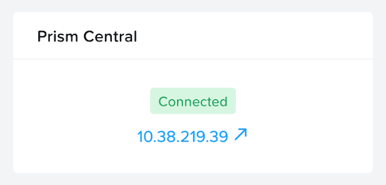

# Overview

!!!info
       Estimated time to complete: **30 Minutes**

This lab will introduce Prism Central's(PC) One-Click deploy process

## Create Primary and Secondary networks

!!!alert

    The Primary network is for PC and other VMs deployment, the Secondary network is requried in X-Ray lab

1. Open ``https://_cluster_IP:9440`` (https://10.42.xx.37:9440)
in your browser and log in with the following credentials:

    -  **Username** - admin
    -  **Password** - check password in RX

1.  In the Prism Element UI click :fontawesome-solid-gear: > **Network Configuration > Create Subnet**

2.  Fill out the following fields:

    -  **Name** - Primary
    -  **Virtual Switch** - vs0
    -  **VLAN ID** - 0
    -  **Enable IP address management** - leave it unselected

3.  Click **Save**

4.  Create the second network by clicking on **+ Create Subnet** with
    the following details:

    -  **Name** - Secondary
    -  **Virtual Switch** - vs0
    -  **VLAN ID** - *HPOC Cluster ID* 1 (e.g. for **PHX-POC079**,
        VLAN ID would be **791**)
    -  **Enable IP address management** - leave it unselected

5.  Click **Save**

6.  You should see two networks as shown here

    

## Prism Central Deploy

1. Navigate to **Home** page and click cluster name **POCxx-ABC** and provide a cluster data service ip **10.42.xx.38** (found in RX). 

    

1.  Navigate to **Home** page and click **Register or create new** in
    Prism Central widget.

    

1.  Choose the first **Deploy** option.

    

2. In the **Version** page, enter the following details 

     - **Create PC Name** - PC
     - **Available versions** - pc.7.5.0.2

3. In the **Size and Scale** page, Choose **Small** (S)
4. Click **Next** 
5. IN the Configuration page, fill out the following fields:

    -  **Network** - Primary
    -  **Subnet Mask** - choose from json file provided
    -  **Gateway** - choose from json file provided
    -  **DNS Address(es)** - choose from json file provided
    -  **NTP Address(es)** - 0.pool.ntp.org
    -  **Select A Container** - SelfServiceContainer
    -  **VM Name** - PC
    -  **IP Address** - ``10.x.x.7``

6. Click **Deploy**

7.  For Microservices, click **Next**.

8.  Click **Deploy**

    !!!note
           The deployment will take about 30 mins, you can go to next lab sessions while waiting. After Prism Central VM is successfully deployed, open ``https://_PC_VM IP:9440`` (https://10.42.xx.39:9440) in your browser and log in with the following credentials:

1.  When the deployment finishes, browse to your Prism Central IP
    address (e.g. 10.42.XX.39) with the following details:

    -  **Username** - admin
    -  **Password** - default with capital N
    -  change password to - check password in RX

1.  Test if you can login Prism Central with the new password

1.  Accept EULA if displayed

## Prism Central Registration

1.  Go back to POCxx-ABC Cluster (https://10.42.xx.37:9440)

2.  Click **Register or create new** in Prism Central widget. 

    

3.  Choose the second **Connect** option. 

    

4.  Click **Next** 

    

5.  Fill out the following fields, leave others as default and click **Connect**:

    -  **Prism Central IP** - 10.42.xx.39
    -  **Port** - 9440
    -  **Username** - admin
    -  **Password** - check password in RX
   
    

    The Prism Central widget will update to show **Conntected** .
   
    

You have successully registered Prism Element to be managed your Prism Central.

!!!note
       Once the Prism Element registration is complete, several management features on Prism Element will be **Read-Only** mode but fully available in Prism Central.

