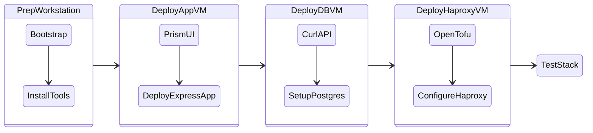

# Getting Started - Nutanix Three-Tier App Lab

This lab demonstrates deploying a complete three-tier application on Nutanix AHV using multiple deployment methods: 

* Prism UI
* OpenTofu Infrastructure as Code (IaC)

The stack includes HAProxy load balancer, Node.js/Express application, and PostgreSQL database.

!!! example "Prerequisites"
    
    - Access to Nutanix Prism Central UI with admin credentials.
    
    - OpenTofu installed (``OpenTofu 1.6+``).
    
    - Existing subnet, cluster, image (CentOS/Ubuntu Cloud), and default storage container in Prism Central.​
    
    - Cloud-init userdata.yaml for VM customization (hostname, SSH keys).​
    - [OpenTofu](https://opentofu.org/) cli, see [installation instructions](..//infra/workstation.md#install-opentofu) here.
    - Existing Nutanix AHV Subnet configured with IPAM
    - SSH Public Key needed for initial `cloud-init` bootstrapping
        - On MacOS/Linux machine, see [Generate a SSH Key on Linux](../infra/workstation.md#generate-a-rsa-key-pair) example.
        - On Windows machine, see [Generate a SSH Key on Windows](../infra/workstation.md#generate-a-rsa-key-pair) example.

## Lab Overview

Deploy a production-like three-tier application stack:

- 1 x MySQL DB VM - Persistent data storage
- 2 x Frontend Wordpress App VM
- 1 x HAProxy VM - Load balancer frontend
  
The application provides a todo list REST API accessible via `http://haproxy-ip/todos`.

## What You’re Building

A simple three-layer application stack where:

A MySQL database server runs on one machine (VM)

A Web server runs on another Ubuntu machine and connects to the database

> The web server hosts a PHP application (e.g., WordPress) that uses the database

An HA Proxy Server that captures web traffic and re-directs to the Web server.